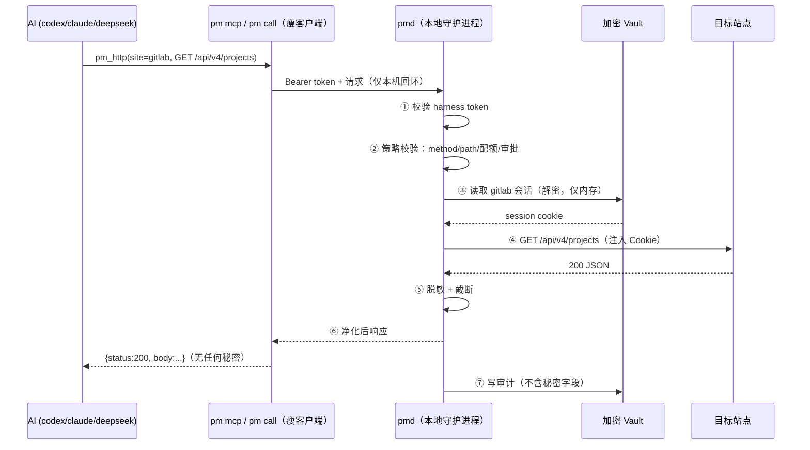

# PM-Broker：面向 AI Harness 的本地密码/凭据代理设计

> 目标用户：在 codex / Claude Code / deepseek-harness 中做功能的开发者，需要让 AI 安全地访问内网或需登录的站点，但**账号、密码、Cookie、Token 等秘密永不进入 AI 上下文**，同时人还能方便地增删改查和审计。

---

## 1. 问题分析

AI harness（codex、Claude Code、deepseek-harness）做功能时经常要访问：

- 内网 GitLab / 内部文档 / 单点登录门户
- Jira、Confluence、测试环境后台
- 需要登录态的 API 或页面

直接把账号密码或 Cookie 给 AI 的问题：

| 风险 | 说明 |
|---|---|
| **上下文泄漏** | 秘密会进入 prompt/历史记录；codex、Claude、deepseek 都走云端模型，秘密事实上被上传 |
| **日志扩散** | harness 的会话日志、截图、报错回显会把秘密落盘到多处，难以清除 |
| **无法审计** | 不知道 AI 用你的身份干过什么，出事无法定位 |
| **无法回收** | 一旦给出去就无法"只收回一部分"，只能改密码，牵连所有使用者 |
| **管理困难** | 多站点多凭据散落各处；Cookie 过期、登录态失效需要人工反复折腾 |
| **响应泄漏** | 站点响应里可能回显 token/session，AI 照抄进结论 |

**结论：凭据必须与 AI 隔离。** 正确形态不是"把密码管理器接给 AI"，而是**凭据代理（Credential Broker）**：AI 请求"以 gitlab 身份调用某个接口"，本地代理注入凭据、转发请求、脱敏响应、记录审计。AI 从头到尾接触不到秘密本身。

---

## 2. 设计原则

1. **秘密永不进入 AI 上下文**——AI 只使用站点别名 + 白名单操作；明文秘密只存在于本地 broker 进程内存中。
2. **默认拒绝（Deny by Default）**——每个 harness 有独立的策略 profile，缺少显式配置时未授权的站点/方法/路径一律拒绝；只有人工明确配置 `default_action: allow` 才切换为默认允许。
3. **代理执行，而非导出秘密**——Cookie/Token 由 broker 注入请求头，永不回传客户端。
4. **可审计、可回收**——每次调用留痕（谁、何时、哪个站点、哪个路径、结果），人工可一键吊销。
5. **人机分工**——人对"凭据本身"负责（增删、轮换、MFA）；AI 对"业务操作"负责。
6. **本地优先**——全部运行在本机回环；不做云同步；vault 加密落盘。

---

## 3. 总体架构

```
┌──────────────────────────── AI Harness ────────────────────────────┐
│  codex (MCP)        Claude Code (MCP)       deepseek-harness (CLI) │
│      │                     │                        │              │
│      └──────────┬──────────┴──────────────┬─────────┘              │
│                 │  只传：站点别名/方法/路径/参数（无秘密）           │
└─────────────────┼─────────────────────────┼────────────────────────┘
                  ▼                         ▼
        ┌─ pm mcp（MCP Server）       pm call（CLI，兜底）──┐
        │              本地回环 + harness token             │
        └───────────────────────┬───────────────────────────┘
                                ▼
                 ┌────────────────────────────────┐
                 │   本地守护进程 pmd（127.0.0.1）  │
                 │  ┌──────────────────────────┐  │
                 │  │ 身份校验（harness token） │  │
                 │  │ 策略引擎（白名单/配额/审批）│  │
                 │  │ 凭据注入 + HTTP 代理转发   │  │
                 │  │ 响应脱敏 + 截断           │  │
                 │  │ 浏览器隧道（可选）         │  │
                 │  └──────────┬───────────────┘  │
                 └─────────────┼──────────────────┘
                               │ 解密后仅存于内存
                        ┌──────▼──────┐
                        │  加密 Vault  │  ← AES-256-GCM；KEK 来自
                        │ (SQLite)    │     OS keychain / 主密码(Argon2id)
                        └─────────────┘
                               │
                        ┌──────▼──────┐      ┌──────────────┐
                        │   审计日志   │      │  目标站点     │
                        └─────────────┘      │ 内网 GitLab/  │
                        ┌──────────────┐     │ Jira/门户…    │
                        │ 人工管理 CLI/UI│     └──────────────┘
                        │ pm admin / pm ui │
                        └──────────────┘
```

关键点：**pmd 是唯一持有明文秘密的进程**。MCP/CLI 只是瘦客户端，凭 token 走本机回环调用。

---

## 4. 模块设计

### 4.1 加密存储 Vault

- 格式：SQLite（单文件，WAL），`.gitignore` 排除；每个 `site` 记录一行。
- 加密：
  - 主密钥（KEK）来源二选一：**OS Keychain**（Windows Credential Manager / DPAPI、macOS Keychain、Linux Secret Service，推荐，免密自动解锁）或 **主密码 + Argon2id**。
  - 每个 site 记录一条独立 DEK，用 KEK 包裹；秘密字段（password/cookie/token）用 AES-256-GCM 加密，非敏感元数据（别名、域名、标签）明文以便检索。
- 记录类型（`auth_type`）：
  - `login`：用户名/密码（供 Playwright 登录脚本使用）
  - `cookie_jar`：Cookie 集合（含域名/路径/过期时间）
  - `api_token`：Bearer / Private-Token 等
  - `http_basic`：Basic Auth
  - `oauth`：长期 OAuth token
- 记录元数据：`id、alias(别名)、site_url、auth_type、purpose(用途说明)、tags、login_script、refresh 配置、last_used、expires_at、status`。
- 自动锁定：空闲 N 分钟或系统锁屏后清空内存中的解密材料，下次访问重新解锁。

### 4.2 守护进程 pmd

- 监听 `127.0.0.1:<port>`（Windows/macOS）或 Unix socket（Linux）；仅接受本机连接。
- 认证：`pm token issue --harness codex --expires 30d` 签发每 harness 独立 token；MCP/CLI 通过 `Authorization: Bearer <token>` 或环境变量携带。吊销 token 即回收该 harness 全部能力。
- 职责：身份校验 → 策略校验 → 解密凭据（仅内存）→ 注入并转发 → 脱敏 → 审计 → 返回。

### 4.3 策略引擎

每 harness 一个 profile（YAML），`default_action` 缺省为 **默认拒绝**：

```yaml
# config/harnesses/claude.yaml
token_env: PM_TOKEN_CLAUDE
default_action: deny       # 可显式改为 allow；缺失/非法值按 deny 处理
rate_limit: { req_per_min: 60 }
allow:
  - site: gitlab
    methods: [GET]
    paths: ["/api/v4/projects/**", "/api/v4/groups/**", "/api/v4/version"]
  - site: jira
    methods: [GET, POST]
    paths: ["/rest/api/2/**"]
approval:
  required_for: [POST, PUT, DELETE]   # 需要人工批准才放行（可选）
redact:
  strip_headers: [set-cookie, authorization, proxy-authorization]
  json_keys: ["(?i).*token.*", "(?i).*password.*", "(?i).*secret.*", "api_key"]
  max_response_bytes: 524288           # 超过截断，附 truncated: true
time_window: "mon-fri 09:00-21:00"     # 可选
```

- 路径匹配支持 glob（`**`）与正则；支持 method、query、请求体大小上限。
- `approval` 开启后，高危操作产生 `req-id`，人工在 CLI/UI 里 `pm approve <req-id>` 才执行；AI 得到"等待审批"的状态码。
- 响应脱敏：剥敏感响应头、按正则替换 JSON 字段值、截断超大响应。

### 4.4 会话与 Cookie 生命周期

- **登录脚本**：每个站点一个 `login_<site>.py`，用 Playwright（headless）执行登录流程，把 Cookie/Tab token 存入 vault。
- **MFA 站点**：`requires_human: true` → Playwright 有头窗口弹出，人工完成验证码/OTP，完成后 broker 抓取会话。broker 本身不绕过 2FA。
- **会话保鲜**：
  - 请求返回 401/403 时自动重放登录脚本（受 `refresh_on: [401,403]` 控制）；
  - `pm service run --watch` 定时健康检查，临期提前刷新；
  - 管理 UI 上每个站点显示状态灯（绿/黄/红），人可一键重新登录。
- 优先鼓励改用**长期 API Token/OAuth**（如 GitLab PAT），Cookie 仅作为兜底。

### 4.5 AI 接入层

#### 4.5.1 跨实现协议边界

Python 0.3 起，Broker、daemon 与 MCP 结果统一携带 `protocol=pman`、
`protocol_version=2` 和稳定 `error_code`。调用方按错误码分支，不解析中文错误文案；
完整请求/响应约定见 [pman-protocol.md](pman-protocol.md)。Rust/Tauri 实现必须先兼容
该协议，再替换传输层或存储层。

#### MCP Server（codex / Claude Code 首选）

暴露工具（AI 可见的全部接口，绝不包含秘密）：

| 工具 | 参数 | 返回 |
|---|---|---|
| `pm_sites` | 无 | 站点别名、用途、可用方法/路径范围、登录态状态（无秘密） |
| `pm_http` | `site, method, path, query, json_body, form` | 脱敏后的 `{status, headers(白名单), body, redacted[], truncated}` |
| `pm_browser`（高级） | `site, action(open/goto/click/fill/snapshot), ...` | 浏览器隧道：注入登录态后操作页面，返回脱敏 DOM 摘要 |
| 秘密读取接口 | — | **不提供**；AI 只能通过 `pm_http` 使用站点身份，任何凭据字段都不会返回 |

`pm_http` 的 JSON Schema 示例：

```json
{
  "name": "pm_http",
  "description": "以指定站点身份执行一个 HTTP 请求。凭据由本地代理注入，响应已脱敏。",
  "inputSchema": {
    "type": "object",
    "properties": {
      "site": { "type": "string", "description": "站点别名，见 pm_sites" },
      "method": { "type": "string", "enum": ["GET", "POST", "PUT", "DELETE", "PATCH"] },
      "path": { "type": "string" },
      "query": { "type": "object" },
      "json_body": { "type": "object" },
      "form": { "type": "object" }
    },
    "required": ["site", "method", "path"]
  }
}
```

#### CLI 兜底（deepseek-harness / 一切无 MCP 的 harness）

```bash
pm call --site gitlab --method GET --path "/api/v4/version"
pm call --site jira  --method POST --path "/rest/api/2/search" --json '{"jql":"..."}'
```

- CLI 永远不接受秘密参数（防 shell 历史泄漏）；新秘密只从 stdin 或 0600 权限文件进入。
- 为 deepseek-harness 提供包装脚本 `pm-call.sh` / `pm-call.ps1`，在其外部工具配置里注册为 `pman_http`。

### 4.6 审计

每次调用记录（**不含任何秘密字段**）：

```
时间、harness、token_id、site、method、path、status_code、
响应字节数、脱敏命中数、是否截断、是否被审批、审批人
```

- `pm audit --harness claude --since 1d` 随时可查。
- 管理 UI 提供审计流视图；吊销 token / 收紧策略即刻生效。

### 4.7 人工管理

CLI 全功能管理 + 可选本地 Web UI（`pm ui`，仅监听 127.0.0.1，默认要求人工解锁后开启）：

```bash
pm init                                   # 初始化 vault
pm vault unlock / lock / status
pm site add login  --name gitlab --url https://git.internal --login-script login_gitlab.py
pm site add cookie --name jira   --url https://jira.internal --cookie-json cookies.json
pm site ls / rm / test / rotate
pm session refresh gitlab                  # 有头浏览器人工完成 MFA
pm grant claude --site gitlab --methods GET --paths "/api/v4/**"
pm revoke claude --site jira
pm token issue --harness codex --expires 30d
pm approve <req-id>                        # 审批待执行的高危请求
pm audit --since 7d
pm ui
```

UI 视图：站点卡片（状态灯 + 一键重新登录）、授权矩阵（harness × site × method/path）、审计流、审批队列。

---

## 5. 一次调用的完整时序



AI 全程只接触：站点别名、白名单内路径、脱敏后的业务数据。

---

## 6. 与三个 harness 的集成方式

### 6.1 codex

`~/.codex/config.toml`：

```toml
[mcp_servers.pman]
command = "pm"
args = ["mcp", "--harness", "codex"]
env = { PM_TOKEN = "从 pm token issue 获取" }
```

### 6.2 Claude Code

`claude mcp add pman -- pm mcp --harness claude`，或项目 `.mcp.json`：

```json
{
  "mcpServers": {
    "pman": {
      "command": "pm",
      "args": ["mcp", "--harness", "claude"],
      "env": { "PM_TOKEN": "xxx" }
    }
  }
}
```

### 6.3 deepseek-harness

若其暂不支持 MCP，走 CLI 外部工具。提供包装脚本：

```bash
#!/usr/bin/env bash
# pman_http：site method path [json]
pm call --site "$1" --method "$2" --path "$3" ${4:+--json "$4"}
```

在其工具配置中注册为 `pman_http`，并在提示词中注明："访问需登录的站点请调用 pman_http，禁止要求用户提供凭据"。若后续支持 MCP，直接复用 6.1/6.2 的接入方式。

---

## 7. 安全模型与威胁清单

| 威胁 | 缓解 |
|---|---|
| 秘密进入 AI 上下文/云端 | broker 架构，MCP/CLI 不提供秘密读取接口；响应再做字段与精确值双重脱敏 |
| harness 日志/回显泄漏 | 响应脱敏 + 截断；错误消息不回显凭据；CLI 不接受秘密入参 |
| 响应中回显 token/session | 正则 + 按站点规则脱敏 JSON 字段、剥敏感响应头 |
| 本地其他进程访问 vault | vault 文件加密；pmd 只绑 127.0.0.1；token 认证 + 来源校验 |
| 某 harness 失控/被滥用 | 独立 token 可单独吊销；策略白名单 + 配额 + 时间窗口 |
| 高危操作误执行 | `approval.required_for` 人工审批模式 |
| 内存转储/调试 | 秘密仅在 pmd 进程内存，用后清零（Rust 版可用 zeroize）；自动锁定 |
| Cookie 过期导致 AI 失败重试 | 会话健康检查 + 401 自动重放登录 + 人工一键刷新 |
| 内网自签证书 | per-site 信任配置（标记 trusted CA / 允许 insecure） |
| 供应链冒充 MCP | MCP server 由本程序提供，命令指向固定二进制路径 + 校验 |

---

## 8. 技术选型

| 方案 | 优点 | 缺点 | 适用 |
|---|---|---|---|
| **A. Python 3.12**（推荐起步） | Playwright 登录脚本原生、MCP SDK 成熟、开发快；`uv`/PyInstaller 打包单文件 | 单文件较大、内存清理弱于 Rust | 快速落地、站点登录流程多变 |
| B. Rust | 单二进制、性能与内存安全（zeroize/内存锁）、分发干净 | 登录脚本生态弱、开发慢 | 核心稳定后重写/加固 |
| C. Go | 单二进制、跨平台好 | 同上，Playwright 需要外部 Node | 折中 |

推荐路径：**Python 实现 M1–M3 → 核心（vault/pmd/策略）稳定后视需要 Rust 化**。

依赖：`cryptography`（AES-256-GCM）、`argon2-cffi`、`keyring`（OS Keychain）、`playwright`、`mcp`（官方 SDK）、SQLite 标准库；daemon 用 FastAPI/uvicorn 或 aiohttp。

### 目录结构

```
pm-broker/
├── pyproject.toml
├── src/pman/
│   ├── cli.py            # pm 命令入口（site/token/grant/audit/mcp…）
│   ├── daemon.py         # pmd：127.0.0.1 本地服务
│   ├── vault.py          # SQLite 加密库
│   ├── crypto.py         # Argon2id + AES-256-GCM + OS keychain
│   ├── policy.py         # 白名单/配额/审批/脱敏规则
│   ├── http_proxy.py     # 凭据注入 + 转发 + 响应净化
│   ├── browser.py        # Playwright 登录脚本与浏览器隧道
│   ├── mcp_server.py     # MCP 工具集（pm_sites/pm_http/pm_browser）
│   ├── audit.py          # 审计写入与查询
│   ├── ui.py             # 本地管理 Web UI（可选）
│   └── scripts/          # login_gitlab.py / login_jira.py ...
├── config/
│   ├── vault.yaml
│   └── harnesses/{codex,claude,deepseek}.yaml
├── vault/                # 加密库文件（.gitignore）
└── docs/
```

---

## 9. 实施里程碑

| 阶段 | 内容 | 产出 |
|---|---|---|
| **M1（~1 周）** | vault + 加密、pmd、`pm call`、策略引擎、审计、管理 CLI | 单机可用：`pm site add` → `pm call` |
| **M2（~1 周）** | MCP server、三个 harness 的集成配置与使用文档、脱敏强化 | codex/claude/deepseek 均能安全调用 |
| **M3（1–2 周）** | Playwright 会话刷新 + 人工 MFA、`pm ui`、审批模式、浏览器隧道 | 登录态自愈 + 可视化管理 |
| **M4（可选）** | Rust 核心、导入/导出、证书管理、多 profile 模板 | 加固与分发 |

---

## 10. 关键取舍与开放问题

1. **永远不给 AI 明文秘密**是硬边界；即使某个站点难做登录脚本，也应走"人工预登录生成长期 token"而非放开 secret 导出。
2. deepseek-harness 是否已支持 MCP 需确认：不支持则先走 CLI 兜底，后续可为其加一个 OpenAI 风格 function-call 桥接。
3. 2FA 站点采用"有头浏览器人工完成"模式；OAuth/长期 token 优先于 Cookie。
4. 不提供云同步；跨机器用加密导出/导入。
5. 审批粒度可按站点 × method × path 组合，初期默认关闭（开发效率优先），高危环境开启。
